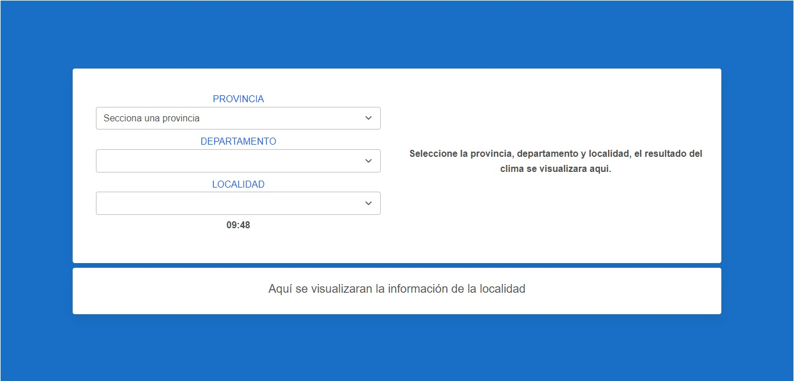
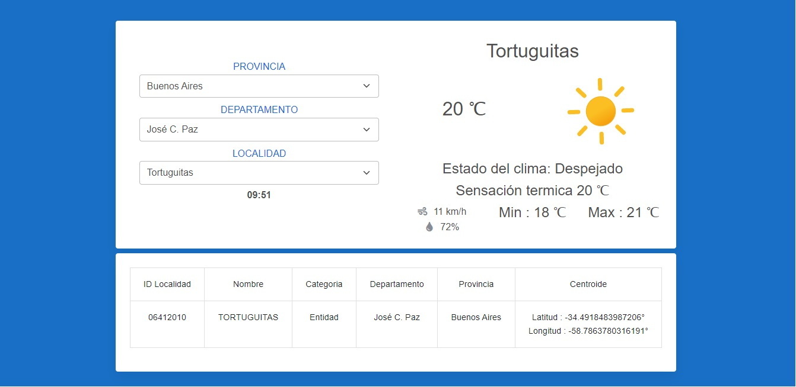

# App-weather-localitie
 See the weather conditions according to your location, Argentina only.
 
 ## Resources used 
* HTML, CSS, JS, JSON
* [Mdbootstrap 5](https://mdbootstrap.com/)
* [Dataset Argentina](https://datos.gob.ar/dataset/jgm_8/archivo/jgm_8.1)
* [Open weather](https://openweathermap.org/)

  ### You need the apikey generated by [Open weather](https://openweathermap.org/), for this you must create a user and password.


* Install package 
```
npm install
```
* Run in development mode
```
npm run dev
```
* Execute project to production
```
npm run build
```
* Preview project
```
npm run preview
```





